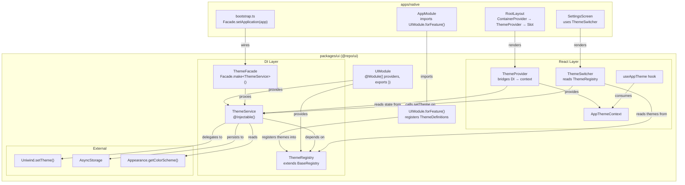
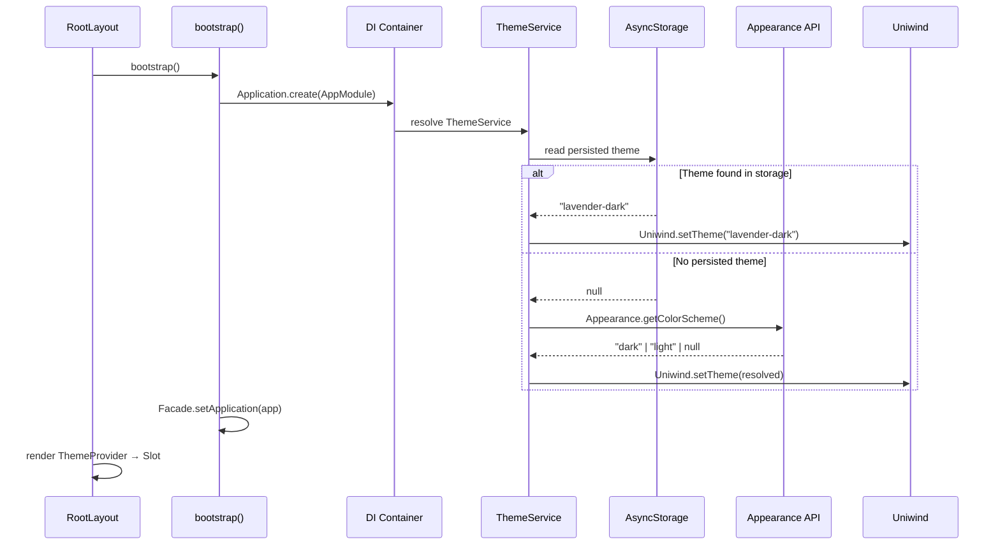

# Design Document — Theme Management System

## Overview

The Theme Management System replaces the current hardcoded theme infrastructure
with a dynamic, registry-driven architecture built on `@stackra` DI conventions.
Today, theme data is duplicated as static `THEME_TOGGLE_MAP` objects in both
`ThemeProvider` and `SettingsScreen`, themes cannot be added at runtime, and the
user's choice is lost on restart.

This design introduces five core pieces:

1. **ThemeRegistry** — a `BaseRegistry` subclass that stores `ThemeDefinition`
   entries keyed by base theme name, enabling dynamic discovery.
2. **ThemeService** — an `@Injectable()` service that owns theme state,
   delegates switching to `Uniwind.setTheme()`, persists the choice to
   AsyncStorage, and detects the system color scheme on first launch.
3. **UIModule** — a `@Module()` with a `forFeature()` static method that accepts
   `ThemeFeatureOptions` and registers definitions into the registry.
4. **ThemeFacade** — a typed constant via `Facade.make<ThemeService>()` for
   static-style access outside React.
5. **ThemeSwitcher** — a data-driven React component that reads all registered
   themes from the registry and renders selectable options with zero hardcoded
   theme lists.

The refactored `ThemeProvider` becomes a thin bridge: it reads state from
`ThemeService` (via the DI container) and feeds it into `AppThemeContext`,
preserving the existing `AppThemeContextValue` interface so all current
consumers of `useAppTheme` continue working without changes.

### Key Design Decisions

| Decision                                                      | Rationale                                                                                                                  |
| ------------------------------------------------------------- | -------------------------------------------------------------------------------------------------------------------------- |
| ThemeRegistry extends BaseRegistry                            | Reuses the proven registry pattern from `@stackra/ts-support`; provides `register`, `get`, `getAll`, `has` out of the box. |
| ThemeService is `@Injectable()` with ThemeRegistry dependency | Centralizes all theme logic (switching, persistence, detection) in a testable service outside React.                       |
| UIModule.forFeature() for theme registration                  | Follows the `@stackra` module pattern; apps declare themes declaratively in their module imports.                          |
| AsyncStorage for persistence                                  | Standard React Native key-value store; already available in Expo 55 without extra dependencies.                            |
| `Appearance.getColorScheme()` for system detection            | Built-in React Native API; no third-party dependency needed.                                                               |
| ThemeFacade via `Facade.make<ThemeService>()`                 | Consistent with the existing facade pattern table; enables non-React code to interact with themes.                         |
| ThemeProvider bridges DI → React context                      | Keeps the React layer thin; all business logic lives in ThemeService.                                                      |

## Architecture



### Initialization Flow



## Components and Interfaces

### ThemeDefinition (Data Object)

```typescript
/**
 * Describes a single theme family with its light/dark variant pair
 * and display metadata for the ThemeSwitcher UI.
 */
export interface ThemeDefinition {
  /** Base theme name, e.g. "lavender", "mint". Used as the registry key. */
  baseName: string;

  /** Human-readable display label, e.g. "Lavender", "Mint". */
  label: string;

  /** Icon identifier for the theme switcher UI. */
  icon: string;

  /** Accent color preview value (CSS color string) for the switcher. */
  accentColor: string;

  /** The [light, dark] variant pair, e.g. ["lavender-light", "lavender-dark"]. */
  variants: ThemePair;
}
```

### ThemeFeatureOptions (Configuration Object)

```typescript
/**
 * Configuration passed to UIModule.forFeature() to register themes.
 */
export interface ThemeFeatureOptions {
  /** Array of theme definitions to register into the ThemeRegistry. */
  themes: ThemeDefinition[];
}
```

### ThemeRegistry (Registry Class)

```typescript
/**
 * Centralized registry of all available themes.
 * Extends BaseRegistry from @stackra/ts-support.
 *
 * @Injectable() — resolved through the DI container.
 */
@Injectable()
class ThemeRegistry extends BaseRegistry<ThemeDefinition> {
  /**
   * Register a theme definition keyed by its baseName.
   * Overwrites any existing entry with the same baseName.
   */
  public register(definition: ThemeDefinition): void;

  /** Retrieve all registered theme definitions as an array. */
  public getAll(): ThemeDefinition[];

  /** Retrieve a single theme definition by baseName, or undefined. */
  public get(baseName: string): ThemeDefinition | undefined;

  /** Check whether a baseName is registered. */
  public has(baseName: string): boolean;

  /**
   * Find the ThemeDefinition that owns a given variant name.
   * Searches all registered definitions for a matching light or dark variant.
   *
   * @returns The matching ThemeDefinition, or undefined.
   */
  public findByVariant(variantName: string): ThemeDefinition | undefined;
}
```

### ThemeService (Injectable Service)

```typescript
/**
 * Manages theme state, switching, persistence, and system detection.
 *
 * @Injectable() — accepts ThemeRegistry as a constructor dependency.
 */
@Injectable()
class ThemeService {
  /** The currently active theme variant name. */
  public get currentTheme(): string;

  /** Whether the current theme is a light variant. */
  public get isLight(): boolean;

  /** Whether the current theme is a dark variant. */
  public get isDark(): boolean;

  /**
   * Initialize the service: read persisted theme or detect system scheme.
   * Called once during DI container bootstrap (onModuleInit lifecycle).
   */
  public async initialize(): Promise<void>;

  /**
   * Switch to a specific theme variant.
   * Delegates to Uniwind.setTheme() and persists to AsyncStorage.
   */
  public setTheme(variantName: ThemeName): void;

  /**
   * Toggle between light and dark variants of the current theme.
   * Falls back to "dark" if the current theme is not in the registry.
   */
  public toggleTheme(): void;

  /**
   * Get the current theme variant name.
   * Alias for the currentTheme getter, useful for facade access.
   */
  public getCurrentTheme(): string;
}
```

### THEME_SERVICE Token

```typescript
/**
 * DI injection token for ThemeService.
 * Used by ThemeFacade and manual injection.
 */
export const THEME_SERVICE = Symbol.for("THEME_SERVICE");
```

### ThemeFacade

```typescript
/**
 * Static-style access to the DI-resolved ThemeService.
 * Wired after Facade.setApplication(app) in bootstrap.
 */
export const ThemeFacade: ThemeService =
  Facade.make<ThemeService>(THEME_SERVICE);
```

### UIModule

```typescript
/**
 * DI module for the shared UI package.
 * Provides ThemeService and ThemeRegistry.
 */
@Module({
  providers: [
    ThemeRegistry,
    { provide: THEME_SERVICE, useClass: ThemeService },
  ],
  exports: [ThemeRegistry, THEME_SERVICE],
})
class UIModule {
  /**
   * Register theme definitions into the ThemeRegistry.
   * Returns a dynamic module configuration.
   */
  public static forFeature(options: ThemeFeatureOptions): DynamicModule;
}
```

### ThemeProvider (Refactored)

The refactored `ThemeProvider` no longer contains a hardcoded
`THEME_TOGGLE_MAP`. Instead, it reads state from `ThemeService` via the DI
container and provides it through `AppThemeContext`. The `AppThemeContextValue`
interface remains unchanged so existing consumers of `useAppTheme` continue
working.

```typescript
function ThemeProvider({ children }: ThemeProviderProps): React.JSX.Element {
  // Read current theme from Uniwind (reactive)
  // Derive isLight/isDark using Str.endsWith
  // Delegate setTheme/toggleTheme to ThemeService via ThemeFacade
  // Provide AppThemeContextValue through AppThemeContext.Provider
}
```

### ThemeSwitcher (New Component)

```typescript
/**
 * Data-driven theme selector that reads all themes from ThemeRegistry.
 * Contains zero hardcoded theme names.
 */
function ThemeSwitcher(): React.JSX.Element {
  // Read all ThemeDefinitions from ThemeRegistry via ThemeFacade or hook
  // Read current theme state from useAppTheme()
  // Render each theme as a selectable card with label, accent preview, active indicator
  // On selection: call setTheme with the appropriate variant based on current light/dark mode
}
```

### useAppTheme Hook (Unchanged)

The existing `useAppTheme` hook remains unchanged. It consumes `AppThemeContext`
and throws if used outside a `ThemeProvider`.

## Data Models

### ThemeDefinition

| Field         | Type        | Description                              | Example                               |
| ------------- | ----------- | ---------------------------------------- | ------------------------------------- |
| `baseName`    | `string`    | Registry key, the base theme family name | `"lavender"`                          |
| `label`       | `string`    | Human-readable display name              | `"Lavender"`                          |
| `icon`        | `string`    | Icon identifier for the switcher UI      | `"palette"`                           |
| `accentColor` | `string`    | CSS color string for accent preview      | `"oklch(77% 0.13 305)"`               |
| `variants`    | `ThemePair` | Tuple of `[light, dark]` variant names   | `["lavender-light", "lavender-dark"]` |

### AsyncStorage Schema

| Key              | Type             | Description                                               |
| ---------------- | ---------------- | --------------------------------------------------------- |
| `@repo/ui:theme` | `string \| null` | The persisted theme variant name (e.g. `"lavender-dark"`) |

### ThemeRegistry Internal Storage

The registry stores `ThemeDefinition` entries in a
`Map<string, ThemeDefinition>` keyed by `baseName`. This is inherited from
`BaseRegistry`.

### Default Theme Definitions

These are the theme definitions registered via `UIModule.forFeature()` in the
native app's `AppModule`:

| baseName     | label        | variants                              |
| ------------ | ------------ | ------------------------------------- |
| `"default"`  | `"Default"`  | `["light", "dark"]`                   |
| `"lavender"` | `"Lavender"` | `["lavender-light", "lavender-dark"]` |
| `"mint"`     | `"Mint"`     | `["mint-light", "mint-dark"]`         |
| `"sky"`      | `"Sky"`      | `["sky-light", "sky-dark"]`           |

### File Structure

All new files follow `@stackra` conventions (kebab-case + suffixes):

```
packages/ui/src/
├── constants/
│   └── tokens.constant.ts          # THEME_SERVICE symbol token
├── contexts/
│   └── theme.context.ts             # AppThemeContext (existing, unchanged)
├── facades/
│   └── theme.facade.ts              # ThemeFacade constant
├── hooks/
│   └── use-app-theme.hook.ts        # useAppTheme (existing, unchanged)
├── registries/
│   └── theme.registry.ts            # ThemeRegistry class
├── services/
│   └── theme.service.ts             # ThemeService class
├── types/
│   ├── theme.type.ts                # ThemeName, ThemePair (existing)
│   ├── theme-definition.type.ts     # ThemeDefinition interface
│   └── theme-feature-options.type.ts # ThemeFeatureOptions interface
├── components/
│   └── theme-switcher.component.tsx  # ThemeSwitcher component
├── providers/
│   └── theme-provider.tsx            # ThemeProvider (refactored)
├── ui.module.ts                      # UIModule with forFeature()
└── index.tsx                         # Barrel exports (updated)

apps/native/src/
├── app.module.ts                     # Updated: imports UIModule.forFeature()
├── bootstrap.ts                      # Existing: Facade.setApplication(app)
└── screens/settings/index.tsx        # Refactored: uses ThemeSwitcher
```

## Correctness Properties

_A property is a characteristic or behavior that should hold true across all
valid executions of a system — essentially, a formal statement about what the
system should do. Properties serve as the bridge between human-readable
specifications and machine-verifiable correctness guarantees._

### Property 1: Registry registration round-trip

_For any_ valid `ThemeDefinition`, registering it in the `ThemeRegistry` and
then retrieving it by `baseName` SHALL return a definition with identical
`baseName`, `label`, `icon`, `accentColor`, and `variants` fields. Additionally,
`has(baseName)` SHALL return `true` for registered names and `false` for names
that were never registered.

**Validates: Requirements 1.2, 1.5, 1.7**

### Property 2: Registry duplicate overwrite

_For any_ two `ThemeDefinition` objects sharing the same `baseName` but
differing in other fields, registering both sequentially SHALL result in
`get(baseName)` returning the second definition's field values.

**Validates: Requirements 1.3**

### Property 3: Registry getAll completeness

_For any_ set of `ThemeDefinition` entries with unique `baseName` values,
registering all of them SHALL result in `getAll()` returning an array whose
length equals the number of registered entries and whose contents include every
registered definition.

**Validates: Requirements 1.4**

### Property 4: setTheme delegates to Uniwind and persists to AsyncStorage

_For any_ valid theme variant name, calling `ThemeService.setTheme(variant)`
SHALL invoke `Uniwind.setTheme()` with that exact variant name AND write the
variant name to AsyncStorage under the `@repo/ui:theme` key.

**Validates: Requirements 2.2, 2.3, 3.4**

### Property 5: toggleTheme switches to opposite variant

_For any_ `ThemeDefinition` registered in the `ThemeRegistry` and any current
theme that matches one of its variants, calling `toggleTheme()` SHALL apply the
opposite variant from the same definition's `variants` pair (light → dark, dark
→ light).

**Validates: Requirements 2.4**

### Property 6: isLight and isDark derivation

_For any_ theme name string, `isLight` SHALL be `true` if and only if the name
equals `"light"` or ends with `"-light"`, and `isDark` SHALL be `true` if and
only if the name equals `"dark"` or ends with `"-dark"`. For all other strings,
both flags SHALL be `false`.

**Validates: Requirements 2.6, 2.7, 2.8**

### Property 7: Initialization applies persisted theme

_For any_ theme variant name stored in AsyncStorage, when `ThemeService`
initializes, it SHALL read that name and apply it via `Uniwind.setTheme()` with
the exact stored value.

**Validates: Requirements 3.1, 3.2**

### Property 8: forFeature registers all provided definitions

_For any_ array of `ThemeDefinition` entries passed to
`UIModule.forFeature({ themes: [...] })`, after the DI container resolves, the
`ThemeRegistry` SHALL contain every definition from the array, retrievable by
its `baseName`.

**Validates: Requirements 5.3**

### Property 9: ThemeSwitcher renders all registered themes with metadata

_For any_ set of `ThemeDefinition` entries registered in the `ThemeRegistry`,
the `ThemeSwitcher` component SHALL render an item for each entry displaying its
`label` and `accentColor` preview.

**Validates: Requirements 8.1, 8.2, 8.6**

### Property 10: ThemeSwitcher selects correct variant based on current mode

_For any_ registered `ThemeDefinition` and any current light/dark mode state,
when the user selects that theme in the `ThemeSwitcher`, the component SHALL
call `ThemeService.setTheme()` with the light variant if the current mode is
light, or the dark variant if the current mode is dark.

**Validates: Requirements 8.4**

## Error Handling

### AsyncStorage Read Failure (Initialization)

When `AsyncStorage.getItem()` throws during `ThemeService.initialize()`:

1. The error is caught and logged via the injected logger (or `console.error` as
   fallback).
2. The service falls back to `Appearance.getColorScheme()` to determine the
   initial theme.
3. The app continues operating normally — the user simply starts with the system
   default instead of their persisted choice.

### AsyncStorage Write Failure (Persistence)

When `AsyncStorage.setItem()` throws during `ThemeService.setTheme()`:

1. The error is caught and logged.
2. The in-memory theme state and Uniwind runtime theme are already applied
   (persistence is fire-and-forget).
3. The app continues operating — the theme change is visible but won't survive a
   restart.

### Unregistered Theme on Toggle

When `toggleTheme()` is called and the current theme variant is not found in any
registered `ThemeDefinition`:

1. The service falls back to applying the `"dark"` variant.
2. This handles edge cases where the persisted theme was removed from the
   registry between app versions.

### useAppTheme Outside ThemeProvider

When `useAppTheme()` is called outside a `ThemeProvider`:

1. The hook throws an `Error` with a descriptive message:
   `"useAppTheme must be used within a <ThemeProvider>."`
2. This is the existing behavior and remains unchanged.

### Invalid Theme Variant Name

When `setTheme()` is called with a variant name that doesn't correspond to a
registered `@variant` block in CSS:

1. `Uniwind.setTheme()` is called regardless — Uniwind handles unknown themes
   gracefully (no-op or falls back to default).
2. The variant name is still persisted to AsyncStorage.
3. On next initialization, if the variant is still invalid, the CSS variables
   won't change but the app remains functional.

## Testing Strategy

### Unit Tests (Example-Based)

Unit tests cover specific scenarios, edge cases, and integration points:

| Area                    | Tests                                                                                                                                                                                                          |
| ----------------------- | -------------------------------------------------------------------------------------------------------------------------------------------------------------------------------------------------------------- |
| **ThemeRegistry**       | Registration of a single definition, retrieval of non-existent key returns `undefined`, `@Injectable()` metadata present                                                                                       |
| **ThemeService**        | `toggleTheme` fallback to `"dark"` when theme not in registry, initialization with no persisted theme falls back to system scheme, `Appearance.getColorScheme()` returns `"dark"` / `"light"` / `null` mapping |
| **ThemeService errors** | AsyncStorage read failure logs and falls back, AsyncStorage write failure logs and continues                                                                                                                   |
| **ThemeProvider**       | Context value contains all required fields, context updates when theme changes                                                                                                                                 |
| **useAppTheme**         | Throws when used outside ThemeProvider                                                                                                                                                                         |
| **ThemeSwitcher**       | Active theme indicator shown for current theme, no hardcoded theme names in component                                                                                                                          |
| **UIModule**            | `@Module()` metadata present, `forFeature()` returns valid dynamic module config                                                                                                                               |
| **ThemeFacade**         | Facade resolves after `Facade.setApplication()`                                                                                                                                                                |

### Property-Based Tests

Property-based tests verify universal properties across generated inputs. Each
property test runs a minimum of **100 iterations** using `fast-check`.

| Property    | Test Description                                                                                 | Tag                                                                                    |
| ----------- | ------------------------------------------------------------------------------------------------ | -------------------------------------------------------------------------------------- |
| Property 1  | Generate random ThemeDefinitions, register, verify round-trip retrieval and `has()`              | `Feature: theme-management-system, Property 1: Registry registration round-trip`       |
| Property 2  | Generate pairs of ThemeDefinitions with same baseName, verify overwrite                          | `Feature: theme-management-system, Property 2: Registry duplicate overwrite`           |
| Property 3  | Generate arrays of unique ThemeDefinitions, verify getAll completeness                           | `Feature: theme-management-system, Property 3: Registry getAll completeness`           |
| Property 4  | Generate random variant names, call setTheme, verify Uniwind + AsyncStorage calls                | `Feature: theme-management-system, Property 4: setTheme delegates and persists`        |
| Property 5  | Generate registered ThemeDefinitions + current variant, toggle, verify opposite                  | `Feature: theme-management-system, Property 5: toggleTheme switches variant`           |
| Property 6  | Generate random strings, verify isLight/isDark flags match the naming convention                 | `Feature: theme-management-system, Property 6: isLight and isDark derivation`          |
| Property 7  | Generate random variant names, mock AsyncStorage, initialize, verify applied                     | `Feature: theme-management-system, Property 7: Initialization applies persisted theme` |
| Property 8  | Generate random ThemeDefinition arrays, call forFeature, verify registry contents                | `Feature: theme-management-system, Property 8: forFeature registers all definitions`   |
| Property 9  | Generate random ThemeDefinitions, register, render ThemeSwitcher, verify all labels/colors shown | `Feature: theme-management-system, Property 9: ThemeSwitcher renders all themes`       |
| Property 10 | Generate random ThemeDefinitions + light/dark state, simulate selection, verify correct variant  | `Feature: theme-management-system, Property 10: ThemeSwitcher selects correct variant` |

### Test Configuration

- **Library**: `fast-check` for property-based testing
- **Runner**: `jest` (via `jest-expo` for React Native compatibility)
- **Minimum iterations**: 100 per property test
- **Mocking**: Uniwind, AsyncStorage, and Appearance API are mocked in all
  service-level tests
- **Component tests**: `@testing-library/react-native` for ThemeSwitcher and
  ThemeProvider rendering tests

### Test File Structure

```
packages/ui/src/
├── registries/
│   └── __tests__/
│       └── theme.registry.test.ts       # Unit + property tests for ThemeRegistry
├── services/
│   └── __tests__/
│       └── theme.service.test.ts        # Unit + property tests for ThemeService
├── components/
│   └── __tests__/
│       └── theme-switcher.component.test.tsx  # Unit + property tests for ThemeSwitcher
├── providers/
│   └── __tests__/
│       └── theme-provider.test.tsx      # Unit tests for ThemeProvider
└── hooks/
    └── __tests__/
        └── use-app-theme.hook.test.ts   # Unit tests for useAppTheme
```
